# Project 1: ETL Flow of on-premise data source to Delta Lake storage for analytics/visualization using Microsoft Azure

Source on prem data, transform the data and load it to cloud storage for business use using the power of distributed computing using a cloud provider.Large amounts of data exists in the on prem database. The quantity of data is too large to be transformed locally, repeatedly and in a timely manner thus a cloud platform is utilzied.

<u>**Architecture**</u>

In this case, the on-premises database is SQL server and I have used the publicly available AdventureWorksLT2017 database for this purpose. The reason for using this is, it is lightweight and helps control the costs incurred and to showcase the process rather than the computing power. The size of the Dataset in real life situation would be much larger and the architecture used in this project would still be able to handle it very efficiently. The high-level architecture diagram is as below.

**Components and Data flow:**
• SQL Server: On-premises Database which needs to be transformed. The SQL server was connected to Azure data factory using the self-hosted Integration runtime. The tables in the AdventureWorksLT2017 database was moved and transformed using Data factory into the Azure Data Lake storage. An user was created for the AdventureWorksLT2017 Database and the password was stored in the Key vault and was used by Data factory.

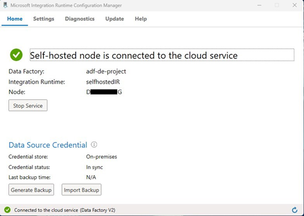

• Azure Data Factory: Used for ingesting data from SQL Server and Storing it in Azure Data Lake using automated pipelines and setup to perform initial transformations on the incoming tables. The ADF resource was added to the access control(IAM) policies of the Data lake so that it is able to perform read, write functions. The tables were converted to parquet format and had the default snappy compression. The tables were stored in their corresponding folder structure which was automated using the pipeline. The diagram below show the pipeline which ingests the data from the on-premises server and carries out the tasks in the pipeline to produce the final transformed data in the gold container.

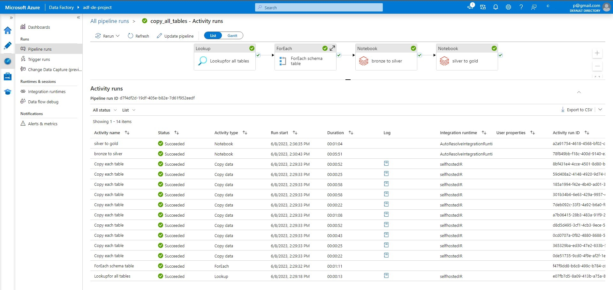
• Azure Data Lake Gen 2: Used for storage of data. Three containers have been created Bronze, Silver and Gold. The three layers represent the stages of business logic and requirements. The initial data ingested from SQL Server is transformed to parquet format as it provides significant performance, storage, and query optimization benefits in big data processing and analytics scenarios and stored in the bronze container. The next level transformation is performed on the bronze data and stored in the silver container. The final transformation is performed on the silver layer and the data is stored in the gold container. The delta lake abstraction layer has been used on the parquet format files for storing the data in the gold and silver containers to allow for versioning. The data in the gold layer is ideal for reporting and analysis. It can be consumed by Azure Synapse Analytics which in turn can be connected to PowerBI for creating visualizations.

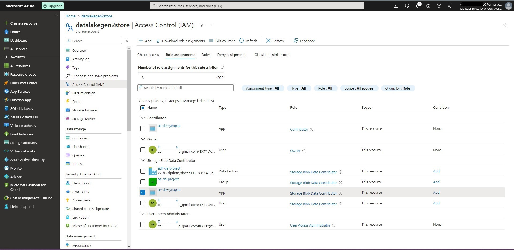
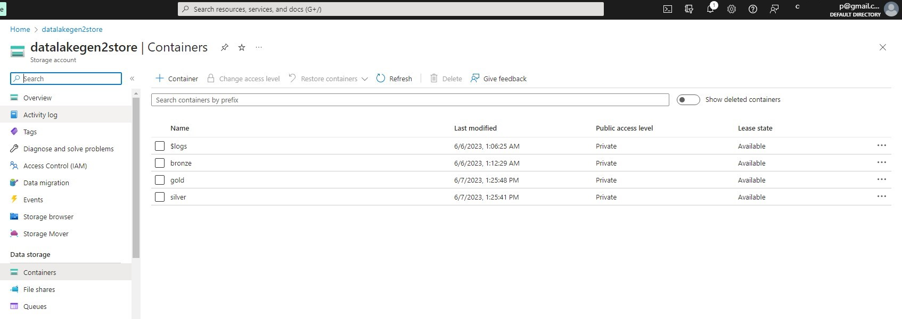
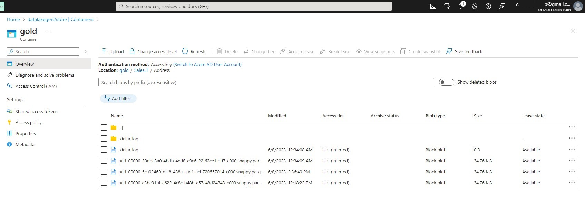
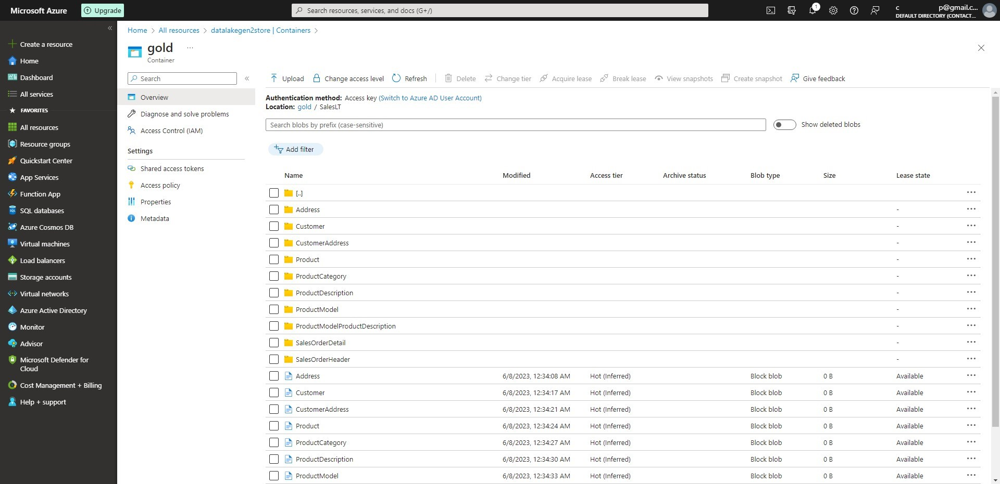

• Databricks: Databricks was the compute engine of choice as it provides the power of Apache spark without the requirement for setting up the environment and since it is cloud native it was well suited for the requirement of this project. It was convenient to access the storage using the credential passthrough feature as the email ID being used for this project was already added to the IAM policy of the data lake. The Data Factory could be connected by using an access token generated from Databricks and saving it as a secret in the Key vault and the storage was mounted using the ‘mount storage’ notebook. There were two levels of transformation performed, first transformation was performed on the data in the bronze container. The output from this layer was stored in the silver container. The second level was performed on the silver data and was stored in the gold container. The idea behind this is in a real business scenario there may be multiple levels of transformation and the final transformed data which is the data in the gold container is used for analytics and reporting. The data in the AdventureWorksLT table is already structured and is mostly readily usable but for the purpose of demonstration the ModifiedDate column has been converted from UTC timestamp to the YYYY-MM-DD format in the bronze to silver transformation and In the silver to gold transformation step, the column names have been changed from two words joined together and each starting with a capital letter to being separated by an ‘_’.

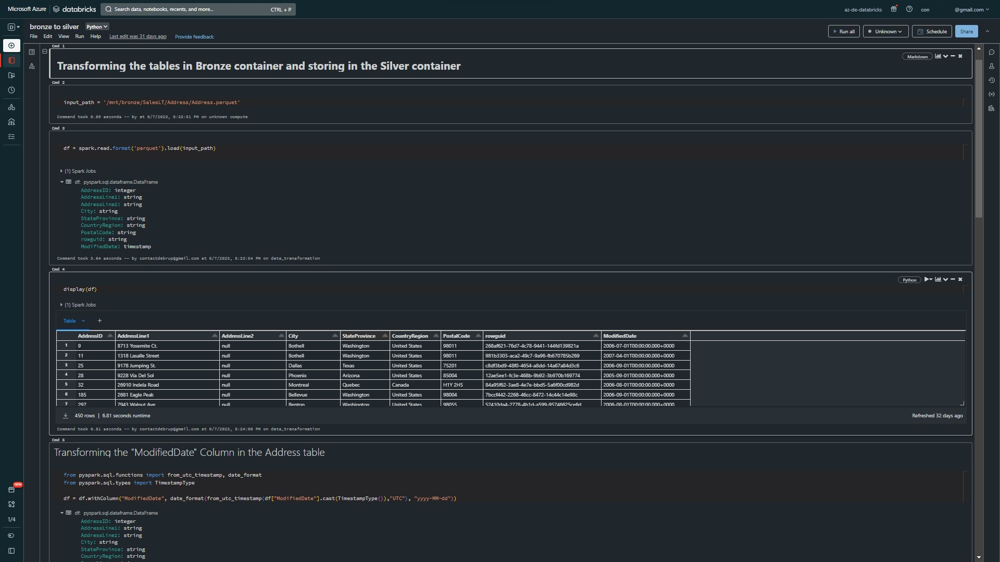
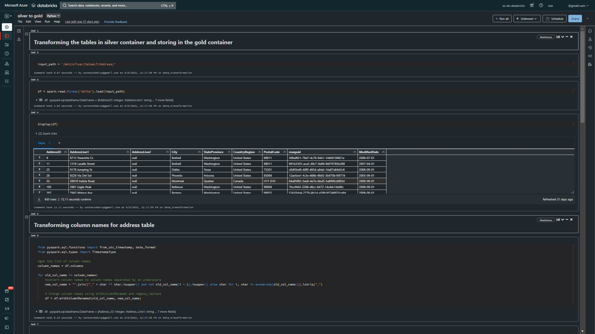

• Azure Synapse Analytics: This was chosen as it integrates data warehousing, big data, and data integration capabilities into a single platform. It is built on a massively parallel processing architecture and an extremely robust analytics tool which shares many functionalities with Azure Data factory. It makes setting up a database and enables querying it in a very short span of time. Costs can be optimized as it supports on-demand provisioning and automatic pause and resume capabilities. It can be easily integrated with the Azure data lake and other Azure services.

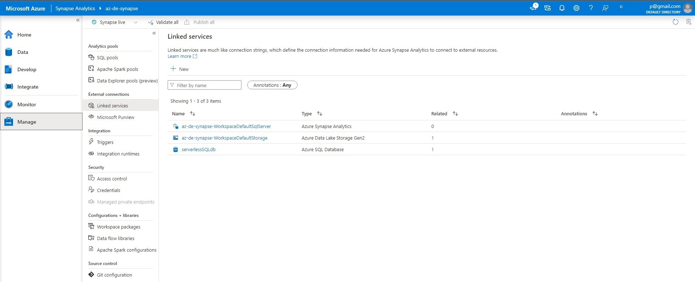
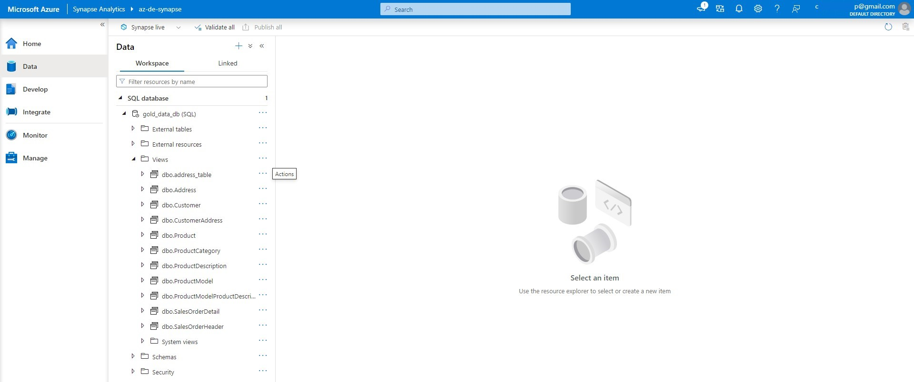
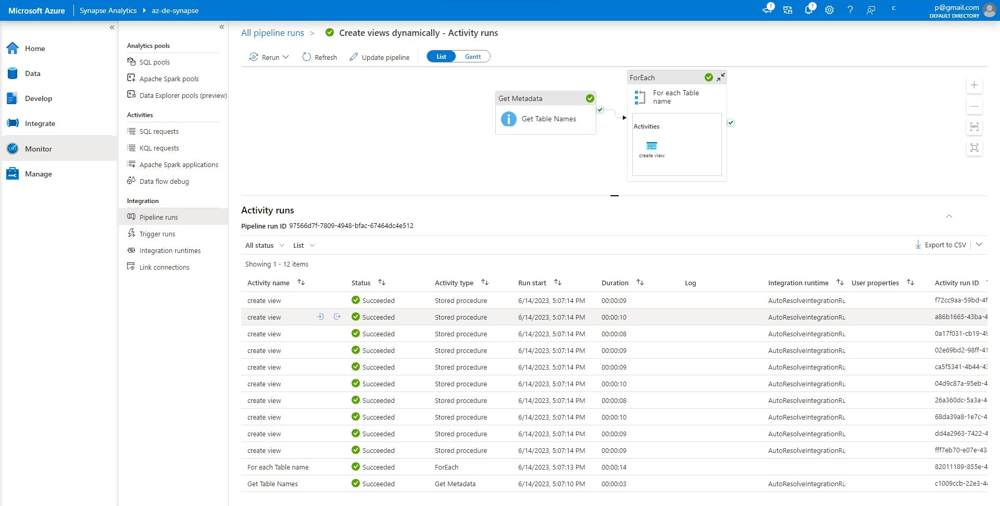

PowerBI : Now that the data can be analyzed using Azure Synapse. We can use that to create dashboards. In this project I have used PowerBI to accomplish that. PowerBI needs to be connected to the the synapse database. We can connect using the Azure Synapse option under Azure from the Data Source option in PowerBI and then entering the severless endpoint of the Synapse in the source and the database name. We can connect using the Sign in option instead of using credentials. This requires the same email address be used for the Azure account and PowerBI sign in. Else, a guest can be invited using Azure active directory and required permission be added to that user. That is the mode that I had to use in this case. The data can be loaded directly onto the device or using direct query. Once the data is loaded it needs to be modelled using the models tab. The relationships generated by PowerBI are usually not correct and it needs to be done manually. This can be achieved using the manage relationship option from the visualizations in ribbon. Once the relationships are set the cross-filter direction needs to be set to both to allow all the fields to be updated across all visualizations in PowerBI.

