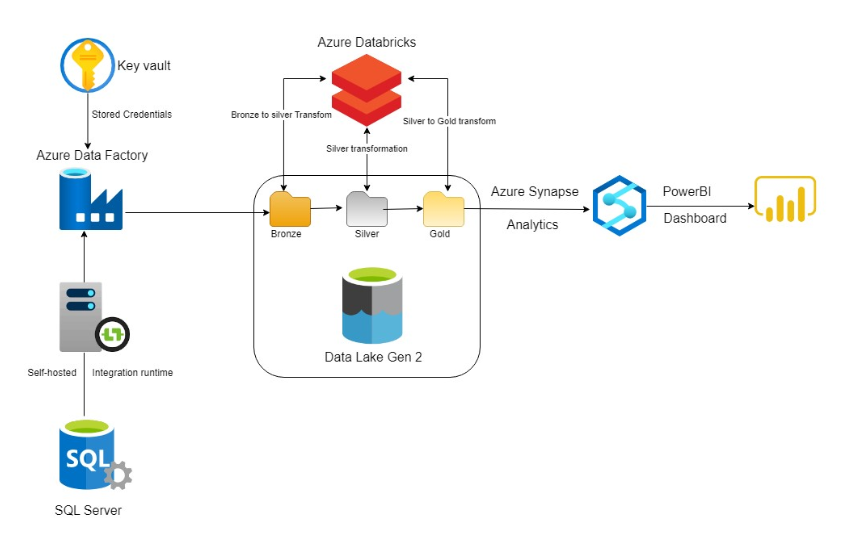
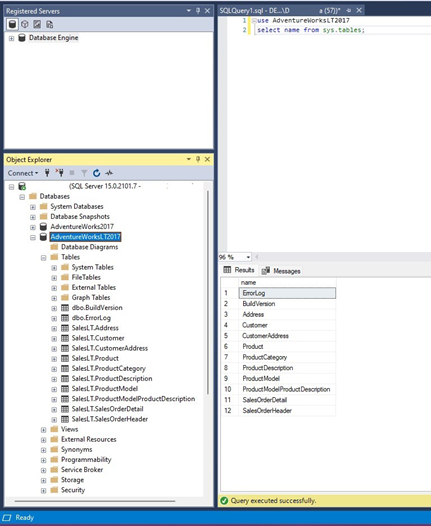

# Project 1: ETL Flow of on-premise data source to Delta Lake storage for analytics/visualization using Microsoft Azure

Source on prem data, transform the data and load it to cloud storage for business use using the power of distributed computing using a cloud provider.Large amounts of data exists in the on prem database. The quantity of data is too large to be transformed locally, repeatedly and in a timely manner thus a cloud platform is utilzied.

In this case, the on-premises database is SQL server and I have used the publicly available AdventureWorksLT2017 database for this purpose. The reason for using this is, it is lightweight and helps control the costs incurred and to showcase the process rather than the computing power. The size of the Dataset in real life situation would be much larger and the architecture used in this project would still be able to handle it very efficiently. The high-level architecture diagram is as below.

**Components and Data flow:**
• SQL Server: On-premises Database which needs to be transformed. The SQL server was connected to Azure data factory using the self-hosted Integration runtime. The tables in the AdventureWorksLT2017 database was moved and transformed using Data factory into the Azure Data Lake storage. An user was created for the AdventureWorksLT2017 Database and the password was stored in the Key vault and was used by Data factory.

